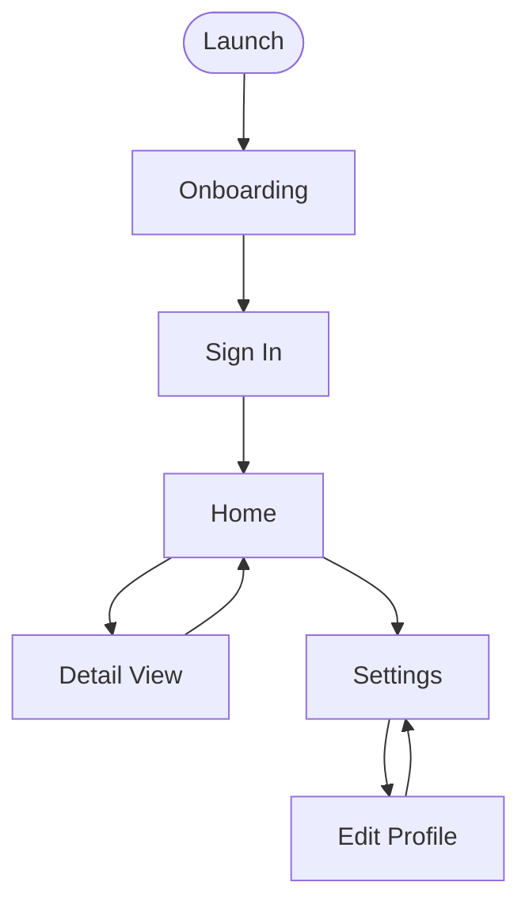

# Vibe-to-Spec Process v1

## Purpose

This process converts an informal description of desired software ("vibe spec") into a production-grade specification suitable for agentic implementation. It requires no specification expertise from the human. The process does the work; the human provides domain knowledge, intent, and decisions.

The underlying thesis: a well-designed elicitation process can produce a production-grade spec from a vague human prompt. "Learn to write specs" is a tool skill being automated away, not a durable competency.

Even a complete spec will encounter conditions that weren't anticipated. The goal of this process is to minimize surprise and make rework cheap and local — not to eliminate it. Some amount of refactoring in any project is unavoidable.

**A note on AI competence:** The AI's assessment reflects general software engineering knowledge. For domains with specialized risk — regulatory compliance, distributed systems, security-critical infrastructure — the output of this process should be reviewed by a domain expert before implementation begins. When the AI detects signals of a specialized domain during elicitation, it surfaces this in the conversation rather than leaving it only as a note in the artifact.

---

## Roles

**Human**
- Writes the initial vibe spec at whatever quality level they can manage
- Declares a desired spec level
- Confirms or corrects the opening restatement
- Answers questions in their own domain language — no technical knowledge required
- Makes decisions when presented with options and trade-offs
- Confirms termination

**AI Partner**
- Assesses current and target spec level honestly, including pushing back when desired level is unachievable
- Produces the opening restatement
- Drives the iteration loop: asks questions in domain language, translates answers into technical requirements, states assumptions, flags conflicts, identifies high-coupling decisions
- Declares diminishing returns with explicit reasoning
- Synthesizes the final spec artifact

---

## A Core Principle: Domain Language First

**Elicitation questions must be asked in the human's language. The AI translates answers into technical requirements — not the other way around.**

A non-technical user cannot be expected to know whether they need "sub-second latency" or a "normalized schema." They can answer: *"If this takes 30 seconds to run, does that block someone from doing their job, or is it a background task they'd walk away from?"*

The AI derives the technical requirement from the domain-language answer and records both. This applies to all elicitation: NFRs, data models, integration points, error handling. The human describes their world; the AI maps it to software requirements.

---

## Spec Levels

Testing is not a Level 2 concern — it begins at Level 1. Every spec must identify what is testable and produce acceptance criteria for those items. Items that cannot be tested must be explicitly labeled with a reason.

Level definitions are principle-based, not gate-based. The goal is a spec that serves a non-technical human well, not one that satisfies a rigid checklist. A schema or API contract at Level 2 should be expressed at the level of detail the human can provide — even if that means "a table of customer records with name, email, and order history" rather than a full DDL.

| Level | Name | Requirements |
|---|---|---|
| **1** | Implementable | Full happy path specified. Explicit assumptions recorded. Testable behaviors have acceptance criteria. Untestable items labeled with rationale. Major failure modes identified. High-coupling decisions classified. |
| **2** | Verifiable | All of Level 1. Edge cases enumerated with test criteria. NFRs derived from domain-language answers and stated as concrete, measurable values. Integration points described at the level of detail available. Full failure mode coverage. |
| **3** | Complete | All of Level 2. No open questions, or all remaining open questions classified as: unknowable / needs research / indifferent / cheap-to-change. Scope explicitly bounded. No implementation decision left to agent discretion. |

### Desired Level vs. Target Level

- **Desired level** — declared by the human at the start
- **Target level** — assessed by the AI based on what is actually achievable given current knowns

These may differ. When they do, the AI states the gap directly and specifically before any elicitation begins:

> *"You've asked for Level 3. This is currently a Level 1 because the authorization model is undefined and the data source is ambiguous. Level 2 is achievable if you can answer two questions. Level 3 requires a decision you may not be able to make before implementation."*

The AI does not soften this assessment. The human may accept a lower target, provide the missing information, or defer decisions with explicit acknowledgment of the cost.

Even when the human asks for Level 1, the AI always produces a description of what would be needed to reach Level 2. This keeps the ceiling visible and the conversation productive.

---

## The Process

### Step 0: Minimum Viable Input Check and Mode Detection

Before restatement, the AI performs two checks.

**Input check:** Does the vibe spec contain enough signal to identify the core goal?

If yes: proceed to mode detection.

If no (e.g., a single aspirational sentence with no grounding): ask up to three orientation questions before proceeding. These are not elicitation questions — they are the minimum needed to attempt a restatement:

1. What does this replace or make easier?
2. Who uses it, and in what context?
3. What does a successful outcome look like?

Once orientation answers exist, proceed to mode detection.

**Mode detection:** The AI reads the vibe spec for signals that indicate one or more process extensions should be activated. It declares its selection before the restatement:

> *"This sounds like a [mobile app / data pipeline / etc.]. I'll include [mobile-specific / etc.] questions alongside the standard ones. If that's not right, correct me before we continue."*

The human confirms or corrects. A wrong mode detection is treated the same as a restatement failure — it signals ambiguity that will recur. See **Process Extensions** for available extensions and their activation signals.

Once mode is confirmed, proceed to Step 1.

---

### Step 1: Opening Move — Goal Restatement

The AI's first substantive output is a restatement of the human's goals, not an assessment or questions. This is the highest-leverage step in the process. Everything downstream depends on shared understanding of intent.

The restatement covers exactly three things:

1. **The problem being solved** — what situation currently exists that this software addresses
2. **The user and context** — who operates this, in what environment, under what conditions
3. **The definition of success** — what a working system produces or enables, in concrete terms

Format:

> *"Before we go further, here is my understanding of what you're trying to build:*
>
> *[Problem]: ...*
> *[User/Context]: ...*
> *[Success looks like]: ...*
>
> *Is this accurate? Correct anything that's wrong before we proceed."*

The human confirms or corrects. If a correction is needed, the AI notes the nature of the misread — because a restatement failure indicates genuine ambiguity in the vibe spec that will recur during elicitation.

Do not proceed to Step 2 until the restatement is confirmed.

---

### Step 2: Level Assessment

With confirmed intent, the AI:

1. Assigns the current spec level (1, 2, or 3) with specific justification
2. Identifies the target level (highest achievable given current knowns)
3. Compares to the human's desired level
4. If desired > target: states blockers explicitly and offers a path to close the gap
5. Identifies all high-coupling decisions present in the spec (see Step 4 below)

This assessment is shown to the human before elicitation begins.

---

### Step 3: Iteration Loop

Repeat until target level is reached or diminishing returns are declared.

**Each round:**

1. **Prioritize gaps** by implementation risk. Address what would block or break implementation before addressing what would merely improve it.

2. **Ask or assume.** For each gap:
   - If high-stakes: ask a targeted question in domain language. Generic technical questions ("what are your performance requirements?") are not acceptable. Questions must be grounded in the human's specific context ("if this report takes a minute to generate, does that block your team or is that fine?").
   - If low-stakes: state an explicit assumption and move on. A gap is low-stakes if getting it wrong requires changing fewer than ~3 isolated implementation decisions and does not touch a high-coupling decision.

3. **Confirm translations.** When a domain-language answer is translated into a technical requirement, show the translation in plain language before recording it:
   > *"You said it should feel instant — I've taken that to mean under half a second. Does that match what you meant, or would a few seconds be acceptable?"*
   The human validates the translation in their own terms; the technical value is what gets confirmed. Do not silently record technical derivations.

4. **Handle "I don't know."** When a human doesn't know how to answer a forced choice, the AI presents 2-3 concrete options with plain-language trade-offs expressed as outcomes the human will experience, not technology choices. The AI also explicitly invites domain input:
   > *"There may be options I haven't listed — if you have a preference or constraint from your industry or context, say so and we'll work from there."*
   The human may choose an option, provide their own, or defer with explicit classification.

5. **Batch questions.** Ask no more than 3 questions per round, ordered by priority. Humans answer focused sets better than exhaustive lists.

6. **Build the glossary.** The first time a domain-specific term is introduced — by either party — record it with its agreed definition. If a term appears to shift meaning across rounds, surface the discrepancy and agree on a canonical definition before proceeding:
   > *"You've used 'customer' and 'user' — are these the same person or different roles?"*

7. **Elicit MVP definition.** Once functional requirements are substantially sketched (typically after round 1 or 2), ask once:
   > *"If you could only ship the most essential part of this first — the version that would already be genuinely useful — what would that be?"*
   Record which FRs the human identifies as MVP and their rationale. If the human is unsure, ask what problem they most urgently need solved. Do not infer the MVP without human input.

   After the human declares MVP FRs, check them against the current high-coupling decisions. If any MVP FR has a significant architectural prerequisite — an auth system, a sync engine, a data model — that isn't itself in the MVP, surface it as a forced choice before recording:
   > *"[FR-X] needs [prerequisite] to exist first — that's not in your MVP as described. We can include it as invisible infrastructure (the user never sees it, but it has to be built), or we scope down to a version that doesn't need it yet. Which makes more sense?"*

   **Prerequisites gate (blocking):** Before recording MVP FRs in the artifact, evaluate each against this checklist and populate `mvp.architectural_prerequisites` explicitly — even if the answer is "none":
   - Does this FR read from or write to persistent storage?
   - Does this FR depend on a parsing, transformation, or cryptographic module?
   - Does this FR call an external service, network endpoint, or OS resource?
   - Does this FR require an auth or identity system to exist?

   If any check is yes, that infrastructure is a prerequisite. Record it with a resolution (`invisible_infrastructure`, `scope_reduction`, or `deferred`). If all checks are no, record `architectural_prerequisites: []` explicitly. A silently empty prerequisites section is a spec defect — the check must be performed and the result recorded either way.

8. **Flag specialized domains.** If the spec shows signals of a domain with compliance, regulatory, or safety requirements (healthcare, finance, legal, critical infrastructure), surface this in the conversation:
   > *"This sounds like it may touch [domain]. There are likely requirements in that space I'm not equipped to identify on my own. You may want a domain expert to review the spec before implementation."*
   Record this flag in the Open Questions section of the artifact.

9. **Flag conflicts.** If a human's answer contradicts a prior answer or the original spec, surface the conflict explicitly before proceeding:
   > *"This conflicts with [X] you said earlier. Which is correct, or do both need to be true?"*
   Unresolved conflicts are not papered over — they are recorded as open questions.

10. **Check FR size.** Once functional requirements are substantially complete (typically after round 2), verify each is implementable by a single agent working in isolation. Flag an FR as oversized if it meets two or more of these conditions:
    - Requires reading or modifying more than ~5 existing files
    - Requires more than ~300 lines of new implementation code
    - Calls more than one external system or subsystem (each external system counts as approximately +100 lines of orchestration complexity regardless of line count)

    An oversized FR is a reliability risk in agentic implementation: agents run out of context mid-task and produce incomplete or incorrect output with no visible error. Surface this to the human and propose a concrete split — the human decides, but the risk must be named before synthesis, not discovered at runtime.

    This check is not about technical complexity alone. FR-02 "add a host for TLS scanning" may be only 3 acceptance criteria, but if it requires a network layer, a certificate parser, a database write, and error handling across all three — that is an oversized FR regardless of how it reads.

11. **Re-assess level** after each round. Show the human the updated level and the delta to the next level.

---

### Step 4: High-Coupling Decisions

At each iteration, the AI identifies decisions where being wrong scales in cost with implementation depth. These are flagged regardless of whether the human raised them.

Common examples to check in every spec:
- Data model / schema
- Identity and authorization model — if the spec involves auth or identity in any form, this is automatically a high-coupling decision, not an NFR
- State persistence strategy (where state lives, consistency model)
- Integration contracts (if anything external depends on outputs)
- Deployment and runtime assumptions (job, service, CLI, etc.)

Each high-coupling decision is classified:

| Status | Meaning |
|---|---|
| **Decided** | Explicitly answered; rationale recorded |
| **Deferred with flexibility** | Not answered; implementation instructed to build in abstraction or configurability |
| **Deferred, accepted risk** | Not answered; no flexibility built in; human has acknowledged the rework cost |

A decision cannot remain unclassified in the final spec.

---

### Step 5: Pre-Synthesis Consistency Audit

Before synthesis, the AI performs a full pass over all accumulated answers, assumptions, and requirements to check for:

- Contradictions between early assumptions and later answers
- Requirements that conflict with each other
- High-coupling decisions whose classification is inconsistent with stated requirements
- Glossary terms used inconsistently across sections

The audit produces an explicit output regardless of whether conflicts are found:

> *"Consistency audit complete. I reviewed [N] requirements, [N] assumptions, and [N] high-coupling decisions. [No conflicts found. / I found the following conflicts that need resolution before synthesis: [list].]"*

A clean audit explicitly states what was checked — it is never silent. This gives the human visibility into the audit's surface area and makes gaps attributable to scope rather than oversight. The audit does not claim to catch everything; it reports what it examined.

---

### Step 6: Termination

The AI declares diminishing returns when all remaining open questions fall into one of these categories:

- **Unknowable** — cannot be resolved without implementation data or decisions outside the scope of this session
- **Needs research** — can be resolved, but requires information not available in this session (distinguished from unknowable: this has an answer, it just isn't here yet)
- **Indifferent** — valid either way, low consequence
- **Cheap to change** — low coupling, easily revised after the fact

Declaration format:

> *"The remaining open questions cannot be resolved further in this session. Specifically: [list each with its category]. We have reached Level [N]. Proceed to synthesis?"*

The human confirms before synthesis begins.

---

### Step 7: Synthesis

Before generating the artifact, the AI makes one final pass over the original vibe spec to capture informal signals — growth expectations, scale hints, future intentions — that were not elevated to formal requirements. These populate Section 15 (Handoff State — Intent Signals), clearly distinguished from requirements and explicitly linked to Section 10 (High-Coupling Decisions) so the implementing agent must address them when resolving architectural choices.

The AI produces two outputs:

1. **`spec.md`** — the human-readable artifact. See **Spec Artifact Template** below.
2. **`spec.yaml`** — the machine-readable sidecar. See **`spec.template.yaml`** in this repo for the full schema.

Both outputs must be kept in sync. If they conflict, `spec.md` is the source of truth and `spec.yaml` should be corrected. Implementing agents and orchestration tools should consume `spec.yaml` for programmatic access to requirements, MVP tags, dependency relationships, and handoff state — not parse the markdown.

---

## Implementation Default

Technology choices are left to the implementing agent and are not part of the spec unless the human states explicit constraints. When options are equivalent, prefer:

1. Tools with broad adoption and active ecosystems over niche alternatives
2. Inherently safer tools over those requiring greater care to use correctly

These are defaults, not rules. The implementing agent exercises judgment within them.

When NFRs or requirements materially constrain the technology options (e.g., a stated performance requirement that most default stacks cannot meet), the spec notes this so the implementing agent evaluates fit before writing code rather than after.

---

## Assumption Thresholds

A gap is **low-stakes** (assume, don't ask) if all of the following are true:
- Getting it wrong requires changing fewer than ~3 isolated implementation decisions
- It does not touch a high-coupling decision
- The assumption is reasonable given the stated domain and context

All other gaps are **high-stakes** (ask).

Every assumption made during elicitation is recorded explicitly in the spec artifact's Assumptions section.

---

## Spec Artifact Template

```markdown
# Specification: [Name]

**Spec Level:** [1 / 2 / 3]
**Desired Level:** [what the human requested]
**Date:** [date of synthesis]
**Extensions active:** [None / Mobile / ...]

---

## 1. Problem Statement

**Problem:** [What situation currently exists that this software addresses]
**User/Operator:** [Who runs this, in what environment, with what permissions or context]
**Success condition:** [What a working system produces or enables, in concrete terms]

---

## 2. Glossary

Terms defined during elicitation. All sections of this spec use these definitions consistently.

| Term | Definition |
|---|---|
| [Domain term] | [Agreed definition, including any distinctions from related terms] |

---

## 3. Scope

**In scope:**
- [Explicit list of what this system does]

**Out of scope:**
- [Explicit list of what this system does not do]

---

## 4. MVP Definition

The minimum version of this system that would be genuinely useful. Declared by the human during elicitation.

**MVP is:** [One sentence describing the minimum useful version]

**MVP functional requirements:** [FR-xx, FR-xx, ...]

**Rationale:** [Why these and not others — what problem they solve first]

**Note to implementing agent:** This reflects value priority as declared by the human, not implementation order. Some non-MVP requirements may be architecturally load-bearing and must be built before MVP features can function. Surface any such conflicts before writing code.

---

## 5. Functional Requirements

Numbered list. Each requirement is a complete, testable behavior.
Format: Given [precondition], when [event/input], the system [does X].

MVP items are marked **[MVP]**.

- FR-01 **[MVP]**: ...
- FR-02: ...

---

## 6. Data

**Inputs:**
- [Name, format, source, validation rules — expressed at the level of detail available]

**Outputs:**
- [Name, format, destination]

**Persisted state:**
- [What the system owns, where it lives, retention/consistency requirements]

---

## 7. Business Rules

Rules the system must not violate, distinct from implementation choices.

- BR-01: ...

---

## 8. Error and Failure Handling

For each failure mode: what triggers it, what the system does, who is notified (if anyone).

| Failure | Trigger | Response | Notification |
|---|---|---|---|
| ... | ... | ... | ... |

---

## 9. Non-Functional Requirements

Values are derived from domain-language answers and stated as concrete, measurable criteria.
Adjectives alone (fast, secure, reliable) are not acceptable — each must have a measurable condition.
Auth and identity, if present, belong in Section 10, not here.

Each value must include an inline derivation note citing the domain-language answer it came from. If you cannot cite the derivation, the value is a guess and belongs in Open Questions instead.

- **Performance:** [value — derived from: "quoted or paraphrased domain-language answer"]
  - e.g., "report generation under 10 seconds — derived from: 'users expect it before their next action'"
- **Reliability:** [value — derived from: ...]
- **Operability:** [value — derived from: ...]

*(Omit subcategories not applicable at this spec level.)*

---

## 10. High-Coupling Decisions

Decisions where being wrong scales in cost with implementation depth. When resolving any of these during implementation, the implementing agent must explicitly note how the intent signals in Section 15 influenced the resolution.

| Decision | Status | Notes |
|---|---|---|
| [e.g., Data model] | Decided / Deferred with flexibility / Deferred, accepted risk | [Rationale or flexibility approach] |

---

## 11. Acceptance Criteria and Test Plan

**Testable items** — each maps to one or more functional requirements:

- AC-01 [FR-01]: [Given/when/then test condition]
- AC-02 [FR-02]: ...

**Untestable items:**

| Item | Reason untestable |
|---|---|
| ... | [External dependency / non-deterministic / requires human judgment / etc.] |

---

## 12. Work Decomposition

This section has two distinct parts with different owners. Do not conflate them.

### Value Phases — owned by the human

What user-visible capability is delivered in each phase. Declared during elicitation. Reflects priority and usefulness, not build order.

- **Phase 1 (MVP):** [FR list] — [what the user can do; why this is the minimum useful version]
- **Phase 2:** [FR list] — [what additional capability this adds for the user]

### Implementation Phasing — owned by the implementing agent

The agent is responsible for determining build sequence based on architectural dependencies. This includes invisible infrastructure (auth, data model, sync engine) that must exist before user-facing features can function. The agent must:

1. Map value phases to an implementation sequence
2. Identify any architectural prerequisites not captured in value phases
3. Surface conflicts between declared value phases and build constraints before writing code — do not silently reorder

**Known prerequisites identified during spec:**
- [FR-xx likely requires [prerequisite] — flagged during elicitation, not yet validated]

**Dependency hints** *(intent-level only — not a build plan):*
- [FR-xx likely requires FR-xx to be complete first — reason: ...]
- [FR-xx and FR-xx are likely independent]

**Limitation:** Dependency hints reflect intent and logical inference from the spec, not verified implementation constraints. Implementing agents must derive actual build order from the codebase. Do not treat these as authoritative.

---

## 13. Open Questions

| Question | Category | Owner |
|---|---|---|
| ... | Unknowable / Needs research / Indifferent / Cheap-to-change / Blocked on [X] | ... |

---

## 14. Assumptions

Explicit list of every assumption made during elicitation where the human did not provide an answer.

- [Assumption]: [Rationale for why this was assumed rather than asked]

---

## 15. Handoff State

Structured context for the implementing agent. Divided into three parts.

**Decisions made:**
- [Decision]: [Rationale — why this was chosen over alternatives]

**Pending / deferred:**
- [Item]: [Why deferred, what would resolve it, estimated impact if wrong]

**Intent signals:**
Informal signals from the original vibe spec that did not become formal requirements but reflect the human's broader goals or expectations. These are not requirements. When resolving high-coupling decisions (Section 10), the implementing agent must explicitly address each signal and note how it was weighed.

- [Signal]: [Quoted or paraphrased from vibe spec — brief note on relevance]

---

## 16. Delta to Next Level

What would be required to reach Level [N+1]:

- [Specific gap and what information or decision would close it]
```

---

## What This Process Does Not Do

- Prescribe technology choices (those belong to the implementing agent)
- Replace domain expertise (the human must know their domain; the process extracts it)
- Guarantee a complete spec when the problem itself is genuinely underspecified — it surfaces that condition and names it honestly
- Eliminate refactoring — it reduces the cost of being wrong, not the possibility of it

---

## Process Extensions

The base process handles all project types. Extensions add mode-specific probes, high-coupling decisions, and artifact sections for project types with requirements the base process doesn't fully address.

**How extensions work:**
- Activated during Step 0 mode detection, declared explicitly, confirmed by the human
- Add to the Step 4 high-coupling decisions checklist
- Add probes to the Step 3 iteration loop
- Add sections to the Step 7 synthesis artifact
- A project may activate more than one extension simultaneously

Extensions are additive — they do not replace any part of the base process.

---

### Extension: Mobile (iOS / Android)

**Activated when:** the vibe spec describes an app distributed via app stores, a touch-first interface, or use of device capabilities (camera, location, notifications, biometrics, etc.).

**Declaration format:**
> *"This sounds like a mobile app. I'll include mobile-specific questions about platform, offline behavior, device permissions, and navigation alongside the standard ones. If this is a web or desktop tool, correct me now."*

#### Additional platform declaration

Resolved before the goal restatement, as platform shapes everything downstream. Native vs. cross-platform is a business and maintenance decision as much as a technical one — probe for the underlying constraints before presenting the choice:

- *"Will this be maintained by one person, a small team, or a larger organization?"*
- *"Is it more important to have the smoothest possible experience on each device, or to build faster and maintain one codebase?"*
- *"How quickly does this need to be ready, and is ongoing maintenance budget a concern?"*

Use the answers to inform a plain-language recommendation before asking the human to decide. Then confirm:

- iOS, Android, or both?
- Native or cross-platform — with a specific recommendation and rationale based on the answers above
- Distribution: App Store, Play Store, enterprise/internal, or TestFlight?

#### Additional high-coupling decisions

Add these to the Step 4 checklist when the Mobile extension is active:

| Decision | Why it's high-coupling |
|---|---|
| Platform (iOS / Android / cross-platform) | Shapes every UI, API, and tooling decision |
| Offline and connectivity model | Determines state architecture and sync strategy |
| Authentication pattern | Biometric, social login, Apple/Google sign-in, email — each has distinct UX and implementation implications |
| Backend sync strategy | If there is a server: how data moves, how conflicts are resolved |
| Permissions model | Which device capabilities are required vs. optional; affects first-run UX and store compliance |

#### Additional elicitation probes

Ask these in domain language during the iteration loop:

- *"If someone opens this app and has no signal, what should happen — does it still work, show what it last had, or ask them to reconnect?"*
- *"Does the app need access to anything on the device — camera, location, contacts, notifications?"*
- *"Will users need to sign in? What happens if they get a new phone or log out?"*
- *"Is there information the app stores that would be a problem if someone else picked up the phone and opened it?"*

#### Screen flow diagram

After functional requirements are established and before the pre-synthesis audit, the AI generates a Mermaid flowchart representing the navigation model: screens as nodes, user actions or transitions as labeled edges.

**Complexity cap:** If the app has more than 8 screens, do not generate a single diagram. Break the flow into named sub-diagrams by logical section (e.g., Onboarding, Core Flow, Settings) and confirm each separately. A diagram that cannot be read comfortably will be rubber-stamped, not audited.

Each diagram is presented with a specific walkthrough prompt — not "does this look right?" but:

> *"Here's what I think [section] looks like to navigate. Walk through it as if you're a new user — start at the beginning and tell me if anything is missing, doesn't make sense, or goes somewhere unexpected."*

Corrections are incorporated and the diagram is regenerated until confirmed. All confirmed sub-diagrams are included in the spec artifact as the authoritative navigation model for the implementing agent.

Example structure (not content):



#### Additional artifact sections

Insert these into the spec artifact when the Mobile extension is active:

---

**[MOBILE] Platform & Distribution**

*(Insert after Section 1 — Problem Statement, before Section 2 — Glossary)*

| | |
|---|---|
| **Platform** | iOS / Android / Both |
| **Build approach** | Native / Cross-platform [framework] |
| **Distribution** | App Store / Play Store / Enterprise / TestFlight |
| **Minimum OS version** | [if known or constrained] |

---

**[MOBILE] Screen Flow**

*(Insert after Section 5 — Functional Requirements)*

Navigation model confirmed with human during elicitation. Screens are nodes; labeled edges are user actions or system transitions.

```mermaid
[diagram]
```

**Screens:**
- [Screen name]: [primary purpose, one line]

---
